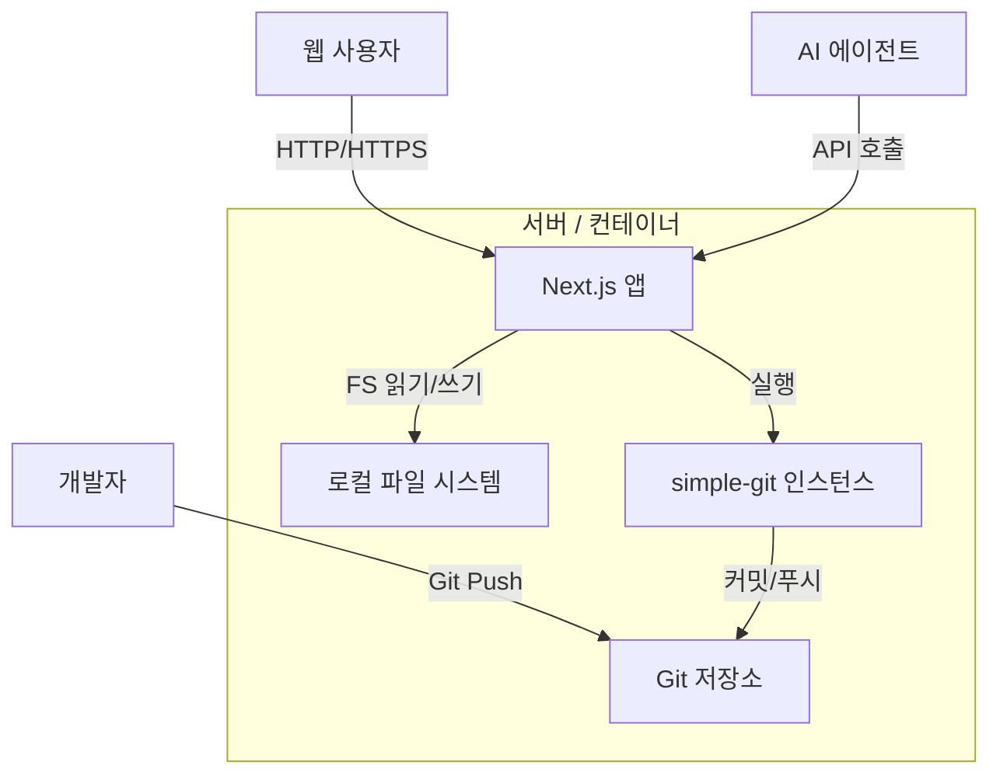

# 기술 요구사항 정의서 (TRD)
## Git-CMS: 아키텍처 및 구현 명세

### 1. 기술 스택 선정 (Technology Stack Selection)

| 컴포넌트 | 선택 | 근거 |
| :--- | :--- | :--- |
| **프레임워크** | **Next.js 14+ (App Router)** | 최고의 React 프레임워크. SSR은 검색엔진 최적화(SEO)에 필수적입니다. App Router는 API 처리를 단순화합니다. |
| **언어** | **TypeScript** | 파일 인터페이스 및 Git 응답에 대한 엄격한 타입 지정. |
| **스타일링** | **TailwindCSS** | 빠른 UI 개발, 일관된 디자인 시스템 유지 용이. |
| **Git 엔진** | **simple-git** | Git 명령어를 위한 성숙한 Node.js 래퍼. 견고하고 널리 사용됨. |
| **마크다운** | **next-mdx-remote** | 마크다운 내에서 React 컴포넌트 사용 가능 (예: 정교한 다이어그램이나 인터랙티브 위젯). |
| **유효성 검사** | **Zod** | 프론트매터 및 API 요청 본문에 대한 런타임 유효성 검사. |

### 2. 시스템 아키텍처 (System Architecture)

#### 2.1 고수준 다이어그램


#### 2.2 디렉토리 구조
저장소를 깔끔하게 유지하기 위해 "콘텐츠 인접(Content Adjacent)" 구조를 채택합니다.

```
/ (루트)
├── .git/
├── content/            # <--- "데이터베이스"
│   ├── index.mdx       # 홈페이지
│   ├── engineering/
│   │   └── architecture.mdx
│   └── images/
├── web/                # <--- 애플리케이션 코드
│   ├── src/
│   │   ├── app/        # Next.js App Router
│   │   │   ├── api/    # 백엔드 라우트
│   │   │   ├── docs/   # 문서 뷰어 페이지
│   │   │   └── page.tsx
│   │   ├── lib/
│   │   │   ├── git.ts  # Git 서비스 래퍼
│   │   │   └── fs.ts   # 파일 시스템 헬퍼
│   │   └── components/
└── package.json
```

### 3. 핵심 모듈 및 API 설계 (Core Modules & API Design)

#### 3.1 Git 서비스 (`lib/git.ts`)
이 싱글톤 서비스는 모든 Git 상호작용을 처리합니다.
- `init()`: 저장소가 존재하는지 확인하고, 없으면 `git init`을 실행합니다.
- `getLog(filePath: string)`: 특정 파일에 대한 커밋 기록을 반환합니다.
- `commitFile(filePath: string, content: string, message: string)`:
    1.  디스크에 콘텐츠 쓰기 `fs.writeFile`.
    2.  `git add <filePath>`
    3.  `git commit -m "<message>"`
- `sync()`: `git pull --rebase` 실행 후 `git push` 실행.

#### 3.2 콘텐츠 API (`app/api/content/route.ts`)
- **GET /api/content?path=...**
    - 원본 콘텐츠 + 파싱된 프론트매터를 반환합니다.
- **POST /api/content**
    - 본문: `{ path: string, content: string, message?: string }`
    - 동작: `GitService.commitFile` 호출.
    - 에러 처리: Git에서 "Merge Conflict" 오류를 포착하여 409 상태 코드를 반환합니다.

### 4. 데이터 모델 (Data Models)

#### 4.1 문서 인터페이스
```typescript
interface DocFile {
  slug: string[];       // 예: ['engineering', 'backend']
  title: string;        // 프론트매터에서 추출
  content: string;      // 본문 내용
  lastUpdated: string;  // 'git log -1'에서의 ISO 날짜
  author: string;       // 'git log -1'에서 추출
}
```

### 5. AI 에이전트 통합 전략 (AI Agent Integration Strategy)
- **컨텍스트 생성:** `/api/ai/context` 엔드포인트는 모든 파일 경로와 트리 구조를 재귀적으로 나열하여 에이전트에게 문서 지도를 제공합니다.
- **의미적 무결성:** 마크다운 파일 간의 모든 링크가 유효한 상대 경로인지 확인하는 린팅 규칙(Remark 플러그인)을 시행하여 에이전트의 탐색을 돕습니다.

### 6. 보안 및 동시성 (Security & Concurrency)
- **로컬:** 인증이 필요하지 않습니다. 커밋 시 `git config user.name`을 사용합니다 (또는 "Guest"로 대체).
- **동시성:** "마지막으로 알려진 커밋 해시"를 사용하여 파일 잠금 메커니즘 또는 낙관적 잠금(Optimistic Locking)을 구현합니다. 클라이언트가 보낸 해시 이후에 파일이 변경된 경우, 저장을 거부합니다.

### 7. AI 에이전트 구현 가이드 (Implementation Hints for AI)
이 프로젝트를 구현하는 에이전트는 다음 지침을 엄격히 준수해야 합니다.

#### 7.1 파일 시스템 조작 시 주의사항
- `fs` 모듈 사용 시 반드시 **비동기(async/await)** 패턴을 사용하십시오.
- 파일 경로 처리는 항상 `path.join()`을 사용하여 OS 간 호환성을 보장하십시오.
- 사용자 입력(파일 경로)을 그대로 `fs`나 `exec`에 전달하지 말고, 반드시 `zod`를 사용하여 경로 트래버설(Path Traversal) 공격을 방지하도록 검증하십시오.

#### 7.2 에러 처리 패턴
- 모든 API 라우트는 `try/catch` 블록으로 감싸야 합니다.
- Git 작업 실패 시 단순 "Error"가 아닌, "충돌 발생(Conflict)", "인증 실패(Auth)", "네트워크 오류" 등을 구분하여 클라이언트에게 반환해야 합니다.

#### 7.3 코드 품질
- **Strict TypeScript:** `any` 타입 사용을 지양하십시오. 모든 데이터 구조에 인터페이스를 정의하십시오.
- **컴포넌트 분리:** 하나의 파일이 200줄을 넘어가면 서브 컴포넌트로 분리를 고려하십시오.
